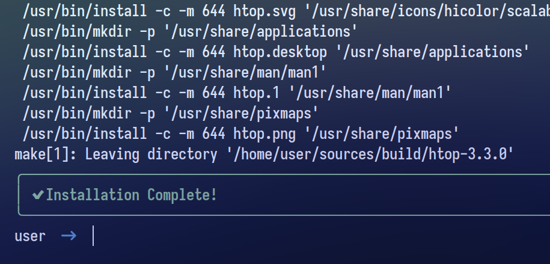

<div align="center">
  <h2 style="font-size: 54px;">
    <strong>
      <a href="https://learnixos.github.io/" style="text-decoration: none; color: inherit;">
        
        In collaboration with the LearnixOS team
      </a>
    </strong>
  </h2>

### 𝙄𝙣𝙨𝙩𝙖𝙡𝙡𝙖𝙩𝙞𝙤𝙣 🍃

```
curl -fsSL https://raw.githubusercontent.com/user7210unix/lxpkg/main/install.sh | bash
```


<h1>
      
</div>
</div> 
  
## ⚙️ Features

  -  Developed from Scratch ⚙️
  -  Written in Python 🐍
  -  Lightweight and Fast ⚡
  -  Supports TOML Configuration Files 📄
  -  Search and Discover Packages 🔍
  -  Update and Remove Packages 🔄
  -  Custom Repository Support 🗃️


### :octocat: ‎ <sup><sub><samp>HI THERE! THANKS FOR DROPPING BY!</samp></sub></sup>


<div style="display: flex; align-items: center; margin-bottom: 40px;">
  <div style="flex: 1; padding-right: 20px;">
    <p><strong>🚀 Resource Efficiency</strong></p>
    <p>Optimized for performance and minimal resource usage.</p>
<h1>
      
</div>
</div> 


