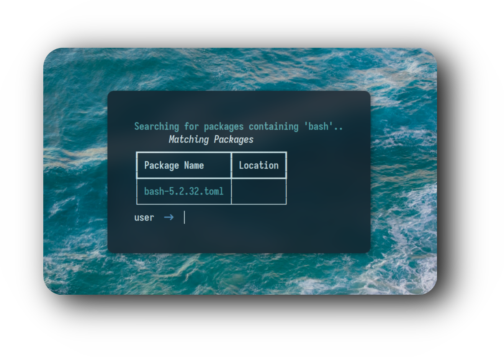
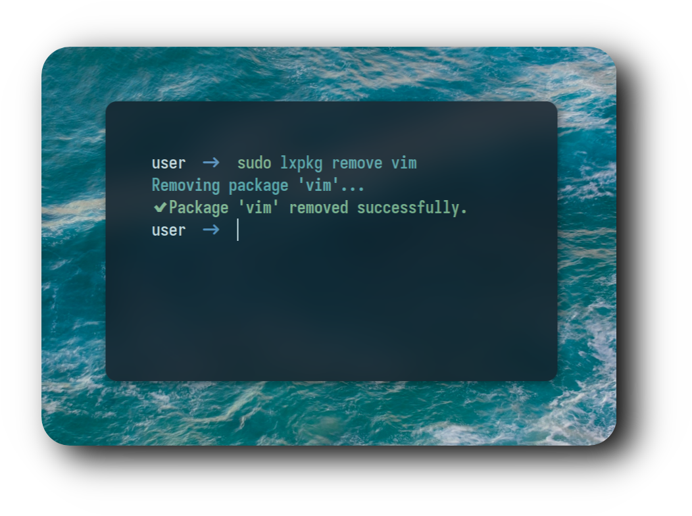

<div align="center">


<div align="center">
  <h2 style="font-size: 74px;">
    <strong>
      <a href="https://learnixos.github.io/" style="text-decoration: none; color: inherit;">
        
        In collaboration with the LearnixOS team
      </a>
    </strong>
  </h2>


<h1>
      
</div>
</div> 

<div align="center">

## ⚙️ 𝙁𝙚𝙖𝙩𝙪𝙧𝙚𝙨

  -  𝗗𝗲𝘃𝗲𝗹𝗼𝗽𝗲𝗱 𝗳𝗿𝗼𝗺 𝗦𝗰𝗿𝗮𝘁𝗰𝗵 ⚙️
  -  𝗪𝗿𝗶𝘁𝘁𝗲𝗻 𝗶𝗻 𝗣𝘆𝘁𝗵𝗼𝗻 🐍
  -  𝗟𝗶𝗴𝗵𝘁𝘄𝗲𝗶𝗴𝗵𝘁 𝗮𝗻𝗱 𝗙𝗮𝘀𝘁 ⚡
  -  𝗦𝗲𝗮𝗿𝗰𝗵 𝗮𝗻𝗱 𝗗𝗶𝘀𝗰𝗼𝘃𝗲𝗿 𝗣𝗮𝗰𝗸𝗮𝗴𝗲𝘀 🔍
  -  𝗨𝗽𝗱𝗮𝘁𝗲 𝗮𝗻𝗱 𝗥𝗲𝗺𝗼𝘃𝗲 𝗣𝗮𝗰𝗸𝗮𝗴𝗲𝘀 🔄
  -  𝗖𝘂𝘀𝘁𝗼𝗺 𝗥𝗲𝗽𝗼𝘀𝗶𝘁𝗼𝗿𝘆 𝗦𝘂𝗽𝗽𝗼𝗿𝘁 🗃️


<h1>
      
</div>
</div> 

<div style="display: flex; align-items: center; margin-bottom: 40px;">
  <div style="flex: 1; padding-right: 20px;">
    <p><strong>🚀 Resource Efficiency</strong></p>
    <p>Optimized for performance and minimal resource usage.</p>
<h1>
  
<div align="center">

### 𝙄𝙣𝙨𝙩𝙖𝙡𝙡𝙖𝙩𝙞𝙤𝙣 🍃

```
curl -fsSL https://raw.githubusercontent.com/user7210unix/lxpkg/main/install.sh | bash
```


### :octocat: ‎ <sup><sub><samp>HI THERE! THANKS FOR DROPPING BY!</samp></sub></sup>

